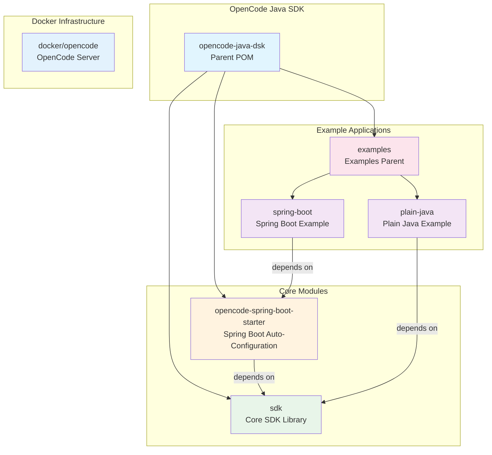

# OpenCode Java SDK

Java SDK for OpenCode Server API with Spring Boot Starter support and example applications.

## Project Overview

This is a multi-module Maven project providing a Java client library for the OpenCode server API. It includes a core SDK module, a Spring Boot starter for easy integration, and example applications demonstrating usage patterns.

The SDK connects to an OpenCode server running via Docker (default port 4096) to provide AI-powered coding assistance capabilities.

## Architecture



## Tech Stack

| Component | Version | Purpose |
|-----------|---------|---------|
| **Java** | 21 | Primary language |
| **Maven** | 3.x | Build and dependency management |
| **Spring Boot** | 4.0.6 | Framework for Spring Boot starter and examples |
| **Jackson** | 2.21.1 | JSON serialization/deserialization |
| **SLF4J** | 2.0.16 | Logging facade |
| **JUnit** | 5.11.4 | Unit testing framework |
| **AssertJ** | 3.26.3 | Fluent assertion library |
| **Lombok** | 1.18.46 | Boilerplate code reduction (Spring Boot example only) |

## Module Structure

| Module | Artifact ID | Packaging | Description |
|--------|-------------|-----------|-------------|
| Root | `opencode-java-dsk` | `pom` | Parent aggregator POM |
| SDK | `opencode-sdk` | `jar` | Core HTTP client library |
| Starter | `opencode-spring-boot-starter` | `jar` | Spring Boot auto-configuration |
| Examples | `opencode-examples` | `pom` | Examples parent POM |
| Plain Java Example | `opencode-examples-plain-java` | `jar` | Plain Java usage example |
| Spring Boot Example | `opencode-examples-spring-boot` | `jar` | Spring Boot usage example |

## Code Style Guidelines

### General
- Use Java 21 features where appropriate
- UTF-8 encoding for all source files
- Base package: `opencode` across all modules

### Lombok Usage
- **SDK module**: NO Lombok - use explicit getters/setters for plain Java compatibility
- **Spring Boot Starter**: NO Lombok - explicit getters/setters for minimal dependency surface
- **Spring Boot Example**: Lombok enabled - use `@Getter`, `@Setter`, `@RequiredArgsConstructor`

### Class Structure
- Do NOT create inner classes - create separate classes in the same package
- Do NOT add JavaDocs to classes and methods (per project convention)
- Keep classes focused on single responsibility

### Error Handling
- Extend `OpenCodeException` for custom SDK exceptions
- Use SLF4J for logging, not System.out
- Validate inputs at method boundaries

## Build Commands

```bash
# Build entire project from project root
mvn clean install

# Build SDK module from project root (also triggers code generation)
mvn compile -pl sdk -am

# Build SDK module from sdk/ directory
mvn compile

# Regenerate SDK sources from OpenAPI spec (then compile)
mvn generate-sources -pl sdk -am

# Run tests
mvn test

# Generate dependency tree
mvn dependency:tree

# Build examples
cd examples/plain-java && mvn clean package
cd examples/spring-boot && mvn clean package
```

## OpenAPI Reference

The OpenCode server API specification is available at:
- Local: `docker/opencode/openapi.json`
- Online Docs: `http://localhost:4096/doc` (when Docker container is running)

## Key Components

### SDK Module (`sdk/`)
The SDK is now auto-generated from OpenAPI specification and includes:

**API Classes** (`opencode.sdk.api`)
- `DefaultApi` - Main API class with 50+ endpoint methods (agents, auth, commands, config, events, files, search, sessions, etc.)
- `SessionApi` - Session-specific operations (sessionChildren, sessionGet)

**Infrastructure** (`opencode.sdk.invoker`)
- `ApiClient` - Base HTTP client for all API calls
- `Configuration` - Global SDK configuration
- `ApiException` - API exception handling
- `ApiResponse<T>` - Generic response wrapper

**Manual Workarounds** (in `src/main/java`)
- `AnyOf` - Workaround for generator bug with `anyOf: [{}, {"type": "null"}]` schemas (in `model/` package)

**Note:** All API, invoker, and model classes are auto-generated into `target/generated-sources/openapi/` at build time. Only `AnyOf.java` exists as a manual source file in `src/main/java/`.

**Models** (`opencode.sdk.model`)
- 150+ auto-generated model classes for requests, responses, and data structures
- `ApiResponse` - Response model (original, in model package)

**Note:** The SDK uses OpenAPI Generator (v7.21.0) to auto-generate classes in `api/`, `invoker/`, and `model/` packages from the OpenAPI specification. These generated classes should not be manually edited. Custom implementations should go in `client/`, `config/`, and `model/` packages.

#### OpenAPI Generator Build Pipeline

The SDK build (`mvn compile -pl sdk`) runs three phases automatically:

1. **`openapi-generator-maven-plugin`** — generates Java sources from `sdk/openapi.json` into `target/generated-sources/openapi/`
2. **`maven-antrun-plugin`** — post-processes generated sources to fix known generator bugs:
   - Replaces `Map<K,V>.class` → `Map.class` (parameterized type literals are invalid Java)
   - Replaces `getMap<K,V>()` → `getMap()` (generics in method identifiers are invalid Java)
3. **`maven-compiler-plugin`** — compiles generated sources + `src/main/java` together

**Known generator bugs requiring manual workarounds:**
- **Map<K,V>.class syntax** — The generator outputs `Map<String, FooValue>.class` in `anyOf` schemas containing map types. Fixed automatically by the antrun plugin.
- **Missing `AnyOf` class** — The generator references `AnyOf` for schemas like `anyOf: [{}, {"type": "null"}]` but never generates the class. A manual `AnyOf.java` is maintained in `src/main/java/opencode/sdk/model/`.

### Spring Boot Starter (`opencode-spring-boot-starter/`)
- `OpenCodeAutoConfiguration` - Auto-configuration class
- `OpenCodeProperties` - Configuration properties binding
- `OpenCodeService` - Spring-managed service wrapper

### Examples (`examples/`)
- Plain Java: Demonstrates direct SDK usage with 18 example classes
- Spring Boot: Comprehensive REST API with 17 controllers covering all SDK endpoints

#### Spring Boot Controllers

The Spring Boot example implements complete API coverage with 17 REST controllers:

| Category | Controllers |
|----------|-------------|
| System & Config | SystemInfoController, ConfigurationController, ProviderController, ProjectController |
| File Operations | FileOperationsController |
| Session Management | SessionCrudController, SessionAdvancedController, MessageController |
| Dev Tools | DevToolsController, ExperimentalController |
| Instance & Interactive | InstanceController, InteractiveController |
| MCP & Extensions | McpController, TodoController, VcsController |
| Real-time | EventStreamingController (SSE), PtyController |

See [`examples/spring-boot/AGENTS.md`](examples/spring-boot/AGENTS.md) for complete documentation.

## Release Scripts

The project includes release automation scripts:
- `release.bat` - Windows release script
- `release.sh` - Linux/macOS release script

These scripts automate: Docker rebuild → OpenAPI spec download → version extraction → POM updates → SDK rebuild.

## Docker Infrastructure

The `docker/opencode/` directory contains the OpenCode server setup:
- **Port**: 4096 (HTTP API)
- **Health**: `GET /global/health`
- **Authentication**: HTTP Basic Auth (default: opencode/opencode123)
- **Provider**: Z.AI with GLM-4.7 model

See `docker/opencode/README.md` for setup instructions.

## Development Guidelines

### When Working on SDK
1. Use plain Java without Lombok
2. Maintain backward compatibility for public APIs
3. Follow existing package structure: `opencode.sdk.*`
4. Use Java's `HttpClient` for HTTP operations
5. Reference `sdk/openapi.json` for API endpoints (copied from `docker/opencode/openapi.json`)

### When Working on Spring Boot Starter
1. Use Lombok for boilerplate reduction
2. Follow Spring Boot auto-configuration patterns
3. Use `@ConditionalOnMissingBean` for optional beans
4. Prefix properties with `opencode.*`
5. Package: `opencode.sdk.springboot.*`

### When Working on Examples
1. Keep examples simple and focused
2. Demonstrate one concept per example
3. Include clear comments for configuration values
4. Show both programmatic and configuration-based setup

## Testing

- Do NOT create tests until directly asked (per project policy)
- Test framework: JUnit 5
- Assertion library: AssertJ
- Spring Boot tests use `spring-boot-starter-test-classic` (intermediate migration step from `spring-boot-starter-test`)

## Migration Notes (Spring Boot 4.0.6)

- **Jakarta EE 11**: `jakarta.annotation-api` upgraded to 3.0.0 in SDK module
- **Starter renames**: `spring-boot-starter-web` → `spring-boot-starter-webmvc`
- **Jackson 2 compat**: `spring-boot-jackson2` module added for Jackson 2 compatibility (Jackson 3 migration deferred)
- **Test starters**: `spring-boot-starter-test` → `spring-boot-starter-test-classic` (individual modular starters migration deferred)

## Security Considerations

- Never commit API keys or credentials
- Use environment variables or external configuration
- Store sensitive data in `.env` files (already in `.gitignore`)
- Validate SSL certificates in production

## Resources

- [Maven Documentation](https://maven.apache.org/guides/)
- [Spring Boot Reference](https://docs.spring.io/spring-boot/docs/current/reference/html/)
- [OpenCode Server API](sdk/openapi.json)
- [Docker Setup](docker/opencode/README.md)
