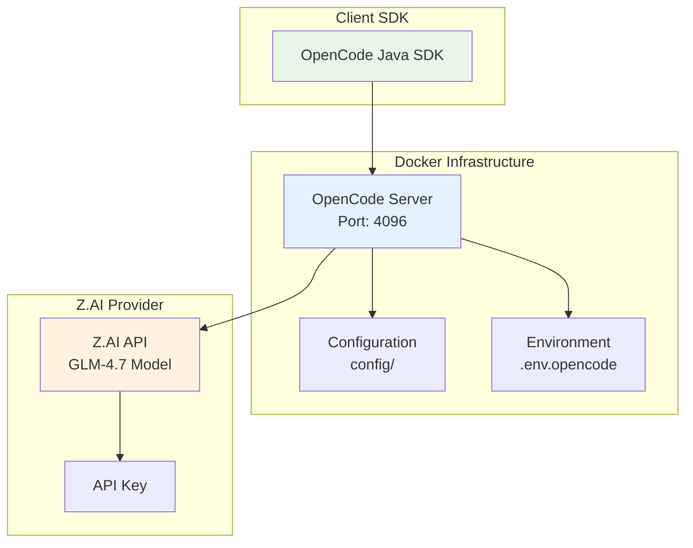

# OpenCode Server Docker Setup

Docker configuration for running OpenCode server with Z.AI provider integration.

## Purpose

This directory contains the Docker Compose setup for running the OpenCode server locally. The server provides the API that the OpenCode Java SDK connects to.

## Architecture



## Components

### Docker Compose
- **File**: `docker-compose.yml`
- **Service**: `opencode-server`
- **Network**: `opencode-sdk` (bridge)

### Configuration Files

| File | Purpose |
|------|---------|
| `Dockerfile` | Container definition |
| `config/opencode.json` | OpenCode server configuration with Z.AI provider |
| `config/auth.json` | Authentication configuration template |
| `start.sh` | Startup script with environment variable handling |
| `.env.opencode` | Environment variables for Docker Compose |

## Default Configuration

### Server Settings
- **Port**: 4096 (HTTP API)
- **Health Endpoint**: `GET /global/health`
- **Documentation**: `http://localhost:4096/doc`

### Authentication
- **Type**: HTTP Basic Auth
- **Default Username**: `opencode`
- **Default Password**: `opencode123`

### Z.AI Provider
- **Model**: GLM-4.7
- **Base URL**: https://api.z.ai/api/coding/paas/v4
- **Max Tokens**: 128000
- **Temperature**: 0.7

## Quick Start

### Start the Server

```bash
# Start services
docker-compose up -d

# Build and start
docker-compose up --build -d

# View logs
docker-compose logs -f opencode-server
```

### Verify Installation

```bash
# Health check
curl http://localhost:4096/global/health

# With authentication
curl -u opencode:opencode123 http://localhost:4096/global/health

# View API docs
open http://localhost:4096/doc
```

## Environment Variables

| Variable | Description | Default |
|----------|-------------|---------|
| `OPENCODE_SERVER_USERNAME` | HTTP Basic Auth username | opencode |
| `OPENCODE_SERVER_PASSWORD` | HTTP Basic Auth password | opencode123 |
| `Z_AI_API_KEY` | Z.AI API key | (pre-configured) |

## Directory Structure

```
docker/opencode/
├── Dockerfile
├── docker-compose.yml
├── start.sh
├── .env.opencode
├── .env.opencode.example
├── .dockerignore
├── config/
│   ├── opencode.json
│   └── auth.json
└── README.md
```

## Volumes

| Volume | Mount Point | Purpose |
|--------|-------------|---------|
| `opencode-data` | `/app/data` | Persistent data storage |
| `opencode-config` | `/app/config` | Configuration files |

## Networking

- **Network Name**: `opencode-sdk`
- **Driver**: Bridge
- **Exposed Port**: 4096

## Security Considerations

1. **Change Default Credentials**
   - Update `.env.opencode` with strong password
   - Do not commit `.env.opencode` to version control

2. **API Keys**
   - Store API keys in environment variables
   - Never hardcode credentials in configuration files

3. **Network Access**
   - Server binds to all interfaces (0.0.0.0)
   - Use firewall rules to restrict access in production

## Troubleshooting

### Check Container Status
```bash
docker-compose ps
docker-compose logs opencode-server
```

### Test Z.AI Connectivity
```bash
docker exec opencode-server \
  curl -H "Authorization: Bearer <api-key>" \
  https://api.z.ai/api/paas/v4/models
```

### Restart Services
```bash
docker-compose restart
docker-compose down && docker-compose up -d
```

## Resources

- OpenAPI Spec: `openapi.json` (310KB)
- Health Check: `http://localhost:4096/global/health`
- API Documentation: `http://localhost:4096/doc`
