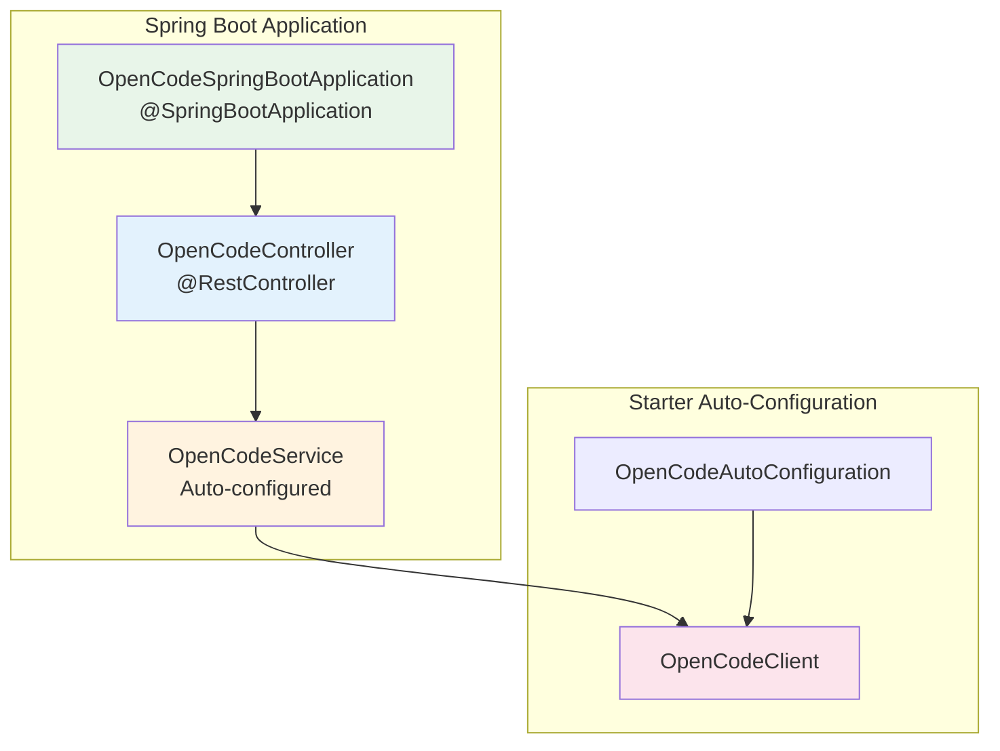

# Spring Boot Example

Demonstrates Spring Boot integration with OpenCode SDK Starter.

## Purpose

This example shows how to use the OpenCode Spring Boot Starter in a Spring Boot application. It demonstrates:
- Auto-configuration of SDK beans
- Configuration via application.yml
- REST controller injection of OpenCodeService
- Environment-based configuration

## Architecture



## Code Style Guidelines

### Lombok Usage
This example USES Lombok (inherited from Spring Boot parent):

```java
@RestController
@RequestMapping("/api")
@RequiredArgsConstructor
public class OpenCodeController {
    private final OpenCodeService openCodeService;
}
```

### REST Controller Patterns

1. **Constructor Injection**
   ```java
   @RequiredArgsConstructor
   public class OpenCodeController {
       private final OpenCodeService openCodeService;
   }
   ```

2. **Endpoint Design**
   ```java
   @GetMapping("/data/{endpoint}")
   public ApiResponse getData(@PathVariable String endpoint) {
       return openCodeService.getData(endpoint);
   }
   ```

3. **Base Path**
   - Use `/api` as base path for all endpoints
   - Use descriptive path variables

## Dependencies

| Dependency | Scope | Purpose |
|------------|-------|---------|
| OpenCode Spring Boot Starter | compile | SDK auto-configuration |
| Spring Boot Starter Web | compile | Web framework |
| Lombok | provided | Boilerplate reduction |
| Spring Boot Starter Test | test | Testing support |

## Configuration

### application.yml

```yaml
opencode:
  base-url: http://localhost:4096
  api-key: ${OPENCODE_API_KEY:default-key}
  timeout: 30

server:
  port: 8081
```

### Environment Variables

| Variable | Description | Default |
|----------|-------------|---------|
| `OPENCODE_API_KEY` | API authentication key | - |
| `OPENCODE_BASE_URL` | OpenCode server URL | http://localhost:4096 |
| `SERVER_PORT` | Application port | 8081 |

## Build and Run

### Build
```bash
# From project root
cd examples/spring-boot
mvn clean package

# Or from this directory
mvn clean package
```

### Run

```bash
# Run with Maven
mvn spring-boot:run

# Or run the JAR
java -jar target/opencode-examples-spring-boot-0.1.0-SNAPSHOT.jar
```

### Access the Application

Once running:
- Application: http://localhost:8081
- API Endpoint: http://localhost:8081/api/data/{endpoint}
- Health Check: http://localhost:8081/actuator/health

## Example Requests

```bash
# Get data from OpenCode server
curl http://localhost:8081/api/data/health

# With parameters
curl http://localhost:8081/api/data/v1/resources
```

## Project Structure

```
src/main/java/opencode/examples/springboot/
├── OpenCodeSpringBootApplication.java     # Main application class
└── controller/
    └── OpenCodeController.java            # REST controller

src/main/resources/
├── application.yml                         # Configuration
└── application-dev.yml                     # Dev profile (optional)
```

## Key Classes

### OpenCodeSpringBootApplication
- Standard Spring Boot main class
- Uses `@SpringBootApplication`
- Runs on port 8081 (to avoid conflict with OpenCode server on 4096)

### OpenCodeController
- REST controller with `/api` base path
- Injects `OpenCodeService` via constructor
- Exposes endpoints that delegate to SDK

## Testing

- Do NOT create tests for this example
- Manual verification via curl/browser is sufficient
- Example is for demonstration only

## Extending the Example

To add new endpoints:

```java
@GetMapping("/custom/{path}")
public ApiResponse getCustomData(@PathVariable String path) {
    return openCodeService.getData("/custom/" + path);
}
```

## Troubleshooting

1. **Port Conflicts**
   - Default port is 8081
   - Change in application.yml if needed

2. **Connection Refused**
   - Ensure OpenCode server is running on port 4096
   - Check Docker: `docker-compose -f docker/opencode/docker-compose.yml up`

3. **Auto-configuration Not Working**
   - Verify starter dependency in pom.xml
   - Check `opencode.*` properties in application.yml
