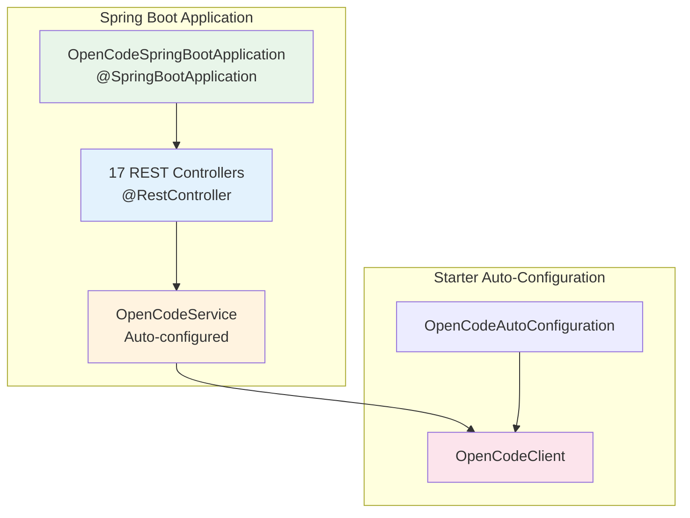

# Spring Boot Example

Demonstrates Spring Boot integration with OpenCode SDK Starter.

## Purpose

This example shows how to use the OpenCode Spring Boot Starter in a Spring Boot application. It demonstrates:
- Auto-configuration of SDK beans
- Configuration via application.yml
- REST controller injection of OpenCodeService
- Environment-based configuration

## Architecture



## REST Controllers

The example implements 17 REST controllers that wrap the OpenCode SDK API endpoints:

### System & Configuration

| Controller | Base Path | Endpoints |
|------------|-----------|-----------|
| [`SystemInfoController`](src/main/java/opencode/examples/springboot/controller/SystemInfoController.java) | `/api/system` | GET /health, GET /skills |
| [`ConfigurationController`](src/main/java/opencode/examples/springboot/controller/ConfigurationController.java) | `/api/config` | GET/PATCH /project, GET /global, GET /providers |
| [`ProviderController`](src/main/java/opencode/examples/springboot/controller/ProviderController.java) | `/api/providers` | GET /, GET /{provider}, POST /{provider}/oauth/authorize, POST /{provider}/oauth/callback |
| [`ProjectController`](src/main/java/opencode/examples/springboot/controller/ProjectController.java) | `/api/projects` | GET /, GET/PATCH /current |

### File Operations

| Controller | Base Path | Endpoints |
|------------|-----------|-----------|
| [`FileOperationsController`](src/main/java/opencode/examples/springboot/controller/FileOperationsController.java) | `/api/files` | GET /tree, GET /content, GET /search, GET /find, GET /symbols, GET /diff, GET /status |

### Session Management

| Controller | Base Path | Endpoints |
|------------|-----------|-----------|
| [`SessionCrudController`](src/main/java/opencode/examples/springboot/controller/SessionCrudController.java) | `/api/sessions` | GET /, POST /, GET/DELETE /{sessionId}, POST /{sessionId}/init |
| [`SessionAdvancedController`](src/main/java/opencode/examples/springboot/controller/SessionAdvancedController.java) | `/api/sessions/advanced` | POST /{sessionId}/fork, POST /{sessionId}/revert, GET /{sessionId}/share, POST /{sessionId}/summarize, GET /{sessionId}/children, POST /{sessionId}/command, POST /{sessionId}/shell |
| [`MessageController`](src/main/java/opencode/examples/springboot/controller/MessageController.java) | `/api/messages` | GET /{sessionId}, POST /{sessionId}/prompt, POST /{sessionId}/abort |

### Development Tools

| Controller | Base Path | Endpoints |
|------------|-----------|-----------|
| [`DevToolsController`](src/main/java/opencode/examples/springboot/controller/DevToolsController.java) | `/api/devtools` | GET /lsp, GET /formatter, POST /log |
| [`ExperimentalController`](src/main/java/opencode/examples/springboot/controller/ExperimentalController.java) | `/api/experimental` | POST /workspace, GET/POST/DELETE /worktree |

### Instance & Interactive

| Controller | Base Path | Endpoints |
|------------|-----------|-----------|
| [`InstanceController`](src/main/java/opencode/examples/springboot/controller/InstanceController.java) | `/api/instances` | GET /, POST /, DELETE /{instanceId} |
| [`InteractiveController`](src/main/java/opencode/examples/springboot/controller/InteractiveController.java) | `/api/interactive` | GET /questions, POST /questions/reply, GET /permissions, POST /permissions/reply, POST /permissions/respond |

### MCP & Extensions

| Controller | Base Path | Endpoints |
|------------|-----------|-----------|
| [`McpController`](src/main/java/opencode/examples/springboot/controller/McpController.java) | `/api/mcp` | GET /, GET /{name}/status, POST /{name}/auth/start, POST /{name}/auth/callback, DELETE /{name}/auth |
| [`TodoController`](src/main/java/opencode/examples/springboot/controller/TodoController.java) | `/api/todos` | GET /{sessionId} |
| [`VcsController`](src/main/java/opencode/examples/springboot/controller/VcsController.java) | `/api/vcs` | GET / |

### Real-time & Streaming

| Controller | Base Path | Endpoints |
|------------|-----------|-----------|
| [`EventStreamingController`](src/main/java/opencode/examples/springboot/controller/EventStreamingController.java) | `/api/events` | GET / (SSE), GET /global (SSE) |
| [`PtyController`](src/main/java/opencode/examples/springboot/controller/PtyController.java) | `/api/pty` | GET /, POST /, GET/PATCH/DELETE /{id} |

## Code Style Guidelines

### Lombok Usage
This example USES Lombok (inherited from Spring Boot parent):

```java
@RestController
@RequestMapping("/api")
@RequiredArgsConstructor
public class OpenCodeController {
    private final OpenCodeService openCodeService;
}
```

### REST Controller Patterns

1. **Constructor Injection**
   ```java
   @RequiredArgsConstructor
   public class SystemInfoController {
       private final OpenCodeService openCodeService;
   }
   ```

2. **Endpoint Design**
   ```java
   @GetMapping("/health")
   public ResponseEntity<GlobalHealth200Response> getHealth() {
       return ResponseEntity.ok(openCodeService.getHealth());
   }
   ```

3. **Base Path**
   - Use `/api` as base path for all endpoints
   - Use descriptive path variables

## Dependencies

| Dependency | Scope | Purpose |
|------------|-------|---------|
| OpenCode Spring Boot Starter | compile | SDK auto-configuration |
| Spring Boot Starter Web | compile | Web framework |
| Lombok | provided | Boilerplate reduction |
| Spring Boot Starter Test | test | Testing support |

## Configuration

### application.yml

```yaml
opencode:
  base-url: http://localhost:4096
  api-key: ${OPENCODE_API_KEY:default-key}
  timeout: 30

server:
  port: 8081
```

### Environment Variables

| Variable | Description | Default |
|----------|-------------|---------|
| `OPENCODE_API_KEY` | API authentication key | - |
| `OPENCODE_BASE_URL` | OpenCode server URL | http://localhost:4096 |
| `SERVER_PORT` | Application port | 8081 |

## Build and Run

### Build
```bash
# From project root
cd examples/spring-boot
mvn clean package

# Or from this directory
mvn clean package
```

### Run

```bash
# Run with Maven
mvn spring-boot:run

# Or run the JAR
java -jar target/opencode-examples-spring-boot-0.1.0-SNAPSHOT.jar
```

### Access the Application

Once running:
- Application: http://localhost:8081
- Health Check: http://localhost:8081/api/system/health
- Skills: http://localhost:8081/api/system/skills
- Sessions: http://localhost:8081/api/sessions

## HTTP Test Files

HTTP test files are available in the `http/` directory at the project root for testing all endpoints:

- `http/system-info.http` - System and health endpoints
- `http/configuration.http` - Configuration endpoints
- `http/provider.http` - Provider management
- `http/project.http` - Project operations
- `http/file-operations.http` - File system operations
- `http/session-crud.http` - Session CRUD operations
- `http/session-advanced.http` - Advanced session operations
- `http/message.http` - Message operations
- `http/devtools.http` - Development tools
- `http/experimental.http` - Experimental features
- `http/instance.http` - Instance management
- `http/interactive.http` - Interactive questions/permissions
- `http/mcp.http` - MCP server management
- `http/todo.http` - Todo operations
- `http/vcs.http` - Version control operations
- `http/event-streaming.http` - SSE event streaming
- `http/pty.http` - PTY operations

## Project Structure

```
src/main/java/opencode/examples/springboot/
├── OpenCodeSpringBootApplication.java     # Main application class
└── controller/
    ├── SystemInfoController.java          # /api/system
    ├── ConfigurationController.java       # /api/config
    ├── ProviderController.java            # /api/providers
    ├── ProjectController.java             # /api/projects
    ├── FileOperationsController.java      # /api/files
    ├── SessionCrudController.java         # /api/sessions
    ├── SessionAdvancedController.java     # /api/sessions/advanced
    ├── MessageController.java             # /api/messages
    ├── DevToolsController.java            # /api/devtools
    ├── ExperimentalController.java        # /api/experimental
    ├── InstanceController.java            # /api/instances
    ├── InteractiveController.java         # /api/interactive
    ├── McpController.java                 # /api/mcp
    ├── TodoController.java                # /api/todos
    ├── VcsController.java                 # /api/vcs
    ├── EventStreamingController.java      # /api/events
    └── PtyController.java                 # /api/pty

src/main/resources/
├── application.yml                         # Configuration
└── application-dev.yml                     # Dev profile (optional)
```

## Key Classes

### OpenCodeSpringBootApplication
- Standard Spring Boot main class
- Uses `@SpringBootApplication`
- Runs on port 8081 (to avoid conflict with OpenCode server on 4096)

### Controllers
- REST controllers with `/api` base path
- Inject `OpenCodeService` via constructor
- Expose endpoints that delegate to SDK

## Testing

### Overview

This module includes comprehensive integration tests using TestContainers to test all REST controllers against a real OpenCode server instance running in Docker. The tests verify endpoint functionality, request/response serialization, and error handling.

### Test Infrastructure

#### OpenCodeServerContainer

Custom TestContainers wrapper that manages the OpenCode server Docker container:

```java
@Container
protected static final OpenCodeServerContainer OPENCODE_CONTAINER = new OpenCodeServerContainer()
    .withReuse(true);
```

**Features:**
- Extends `GenericContainer` from TestContainers
- Exposes port 4096 (OpenCode server default)
- Configures authentication (username: `opencode`, password: `opencode123`)
- Waits for `/global/health` endpoint with 2-minute timeout
- Supports container reuse for faster test execution

**Location:** [`src/test/java/opencode/examples/springboot/testsupport/OpenCodeServerContainer.java`](src/test/java/opencode/examples/springboot/testsupport/OpenCodeServerContainer.java)

#### AbstractIntegrationTest

Base class for all integration tests providing common setup:

```java
@SpringBootTest(webEnvironment = SpringBootTest.WebEnvironment.RANDOM_PORT)
@Testcontainers
@ActiveProfiles("test")
public abstract class AbstractIntegrationTest {
    
    @Container
    protected static final OpenCodeServerContainer OPENCODE_CONTAINER = ...;
    
    @Autowired
    protected TestRestTemplate restTemplate;
    
    @DynamicPropertySource
    static void configureProperties(DynamicPropertyRegistry registry) {
        registry.add("opencode.base-url", OPENCODE_CONTAINER::getBaseUrl);
        registry.add("opencode.username", () -> "opencode");
        registry.add("opencode.password", () -> "opencode123");
    }
}
```

**Features:**
- Runs Spring Boot with random port to avoid conflicts
- Activates `test` profile for test-specific configuration
- Injects `TestRestTemplate` for HTTP requests
- Dynamically configures OpenCode SDK properties from container

**Location:** [`src/test/java/opencode/examples/springboot/testsupport/AbstractIntegrationTest.java`](src/test/java/opencode/examples/springboot/testsupport/AbstractIntegrationTest.java)

### Test Classes

All integration tests follow the naming convention `*IT.java` and extend `AbstractIntegrationTest`:

| Test Class | Controller Tested | Endpoints Covered |
|------------|-------------------|-------------------|
| [`ConfigurationControllerIT`](src/test/java/opencode/examples/springboot/controller/ConfigurationControllerIT.java) | ConfigurationController | GET /api/config/global, GET /api/config/providers, GET /api/config/project, PATCH /api/config/project |
| [`DevToolsControllerIT`](src/test/java/opencode/examples/springboot/controller/DevToolsControllerIT.java) | DevToolsController | GET /api/devtools/lsp, GET /api/devtools/formatter, POST /api/devtools/log |
| [`FileOperationsControllerIT`](src/test/java/opencode/examples/springboot/controller/FileOperationsControllerIT.java) | FileOperationsController | GET /api/files/tree, GET /api/files/content, GET /api/files/search |
| [`InstanceControllerIT`](src/test/java/opencode/examples/springboot/controller/InstanceControllerIT.java) | InstanceController | GET /api/instances, POST /api/instances, DELETE /api/instances/{id} |
| [`MessageControllerIT`](src/test/java/opencode/examples/springboot/controller/MessageControllerIT.java) | MessageController | GET /api/messages/{sessionId}, POST /api/messages/{sessionId}/prompt, POST /api/messages/{sessionId}/abort |
| [`ProjectControllerIT`](src/test/java/opencode/examples/springboot/controller/ProjectControllerIT.java) | ProjectController | GET /api/projects, GET /api/projects/current, PATCH /api/projects/current |
| [`ProviderControllerIT`](src/test/java/opencode/examples/springboot/controller/ProviderControllerIT.java) | ProviderController | GET /api/providers, GET /api/providers/{provider} |
| [`SessionAdvancedControllerIT`](src/test/java/opencode/examples/springboot/controller/SessionAdvancedControllerIT.java) | SessionAdvancedController | POST /api/sessions/advanced/{sessionId}/fork, POST /api/sessions/advanced/{sessionId}/revert, GET /api/sessions/advanced/{sessionId}/children |
| [`SessionCrudControllerIT`](src/test/java/opencode/examples/springboot/controller/SessionCrudControllerIT.java) | SessionCrudController | GET /api/sessions, POST /api/sessions, GET /api/sessions/{sessionId}, DELETE /api/sessions/{sessionId} |
| [`SystemInfoControllerIT`](src/test/java/opencode/examples/springboot/controller/SystemInfoControllerIT.java) | SystemInfoController | GET /api/system/health, GET /api/system/skills |
| [`TodoControllerIT`](src/test/java/opencode/examples/springboot/controller/TodoControllerIT.java) | TodoController | GET /api/todos/{sessionId} |
| [`VcsControllerIT`](src/test/java/opencode/examples/springboot/controller/VcsControllerIT.java) | VcsController | GET /api/vcs |

### Test Naming Conventions

- **Class names:** End with `IT` (e.g., `SystemInfoControllerIT`)
- **Method names:** Use descriptive names following `should<ExpectedBehavior>When<Condition>` pattern
- **Test structure:** Given-When-Then comments for clarity

Example test method:
```java
@Test
void shouldReturnHealthStatusWhenServerIsRunning() {
    // Given - container is running
    
    // When
    ResponseEntity<GlobalHealth200Response> response =
        restTemplate.getForEntity("/api/system/health", GlobalHealth200Response.class);
    
    // Then
    assertThat(response.getStatusCode()).isEqualTo(HttpStatus.OK);
    assertThat(response.getBody()).isNotNull();
}
```

### Running Tests

#### Prerequisites

1. **Docker Desktop** must be installed and running
2. Docker daemon must be accessible (verify with `docker ps`)
3. Sufficient disk space for container images (~500MB)

#### Commands

**Run all integration tests:**
```bash
cd examples/spring-boot
mvn clean verify
```

**Run tests with specific profile:**
```bash
mvn clean verify -P integration-tests
```

**Run specific test class:**
```bash
mvn test -Dtest=SystemInfoControllerIT
```

**Run with debugging:**
```bash
mvn test -Dtest=SystemInfoControllerIT -Dmaven.surefire.debug
```

**Skip integration tests (run only unit tests):**
```bash
mvn clean test -DskipITs=true
```

#### Profile Activation

The tests use the `test` profile activated by `@ActiveProfiles("test")` on the base class. This loads:
- [`application-test.properties`](src/test/resources/application-test.properties)
- Test-specific beans and configuration

### Test Configuration

#### application-test.properties

```properties
# Server Configuration - use random port to avoid conflicts
server.port=0

# OpenCode Configuration
# These values are placeholders - actual values are set by AbstractIntegrationTest
# via DynamicPropertySource from the TestContainers instance
opencode.base-url=http://localhost:4096
opencode.username=opencode
opencode.password=opencode123
opencode.project-path=${user.dir}

# Logging Configuration
logging.level.root=INFO
logging.level.opencode=DEBUG
logging.level.org.testcontainers=INFO

# Test-specific settings
spring.main.banner-mode=off
```

**Location:** [`src/test/resources/application-test.properties`](src/test/resources/application-test.properties)

#### Environment Variables

| Variable | Description | Default |
|----------|-------------|---------|
| `Z_AI_API_KEY` | API key for Z.AI provider (if testing real provider) | `test-key` |
| `TESTCONTAINERS_REUSE_ENABLE` | Enable container reuse between test runs | `false` |
| `TESTCONTAINERS_RYUK_DISABLED` | Disable Ryuk container cleanup (faster but less safe) | `false` |

#### Docker Container Configuration

The TestContainers setup configures the OpenCode server with:
- **Port:** 4096 (mapped to random host port)
- **Username:** opencode
- **Password:** opencode123
- **Health Check:** Waits for `/global/health` returning HTTP 200
- **Startup Timeout:** 2 minutes

### Test Dependencies

| Dependency | Scope | Purpose |
|------------|-------|---------|
| `spring-boot-starter-test` | test | Spring Boot test support |
| `testcontainers` | test | Docker container management |
| `junit-jupiter` | test | JUnit 5 testing framework |
| `assertj-core` | test | Fluent assertions |

### Troubleshooting

#### Docker Connection Issues

**Error:** `Cannot connect to Docker daemon`

**Solution:**
- Ensure Docker Desktop is running
- Check Docker is accessible: `docker ps`
- On Windows: Ensure Docker Desktop is set to use Linux containers
- Try restarting Docker Desktop

#### Container Startup Timeout

**Error:** `Container startup failed with timeout`

**Solution:**
- Increase timeout in `OpenCodeServerContainer.java`:
  ```java
  .withStartupTimeout(Duration.ofMinutes(5))
  ```
- Check Docker has sufficient resources (RAM/CPU)
- Pull the image manually first: `docker pull alpine:latest`

#### Port Conflicts

**Error:** `Port already in use`

**Solution:**
- Tests use random ports (`server.port=0`), but if you see conflicts:
- Check for orphaned containers: `docker ps -a`
- Remove stopped containers: `docker container prune`

#### Test Failures Due to Container Reuse

**Error:** Tests pass individually but fail when run together

**Solution:**
- Container reuse may cause state issues
- Disable reuse: Remove `.withReuse(true)` from `AbstractIntegrationTest`
- Or run with: `TESTCONTAINERS_REUSE_ENABLE=false mvn test`

#### Slow Test Execution

**Optimization tips:**
- Enable container reuse: `TESTCONTAINERS_REUSE_ENABLE=true`
- Disable Ryuk (development only): `TESTCONTAINERS_RYUK_DISABLED=true`
- Run tests in parallel (if tests are independent):
  ```bash
  mvn test -DforkCount=2
  ```

#### Memory Issues

**Error:** `OutOfMemoryError` during tests

**Solution:**
- Increase Maven heap size:
  ```bash
  set MAVEN_OPTS=-Xmx2g
  mvn test
  ```
- Increase Docker Desktop memory allocation (Settings > Resources)

### Project Structure

```
src/test/
├── java/opencode/examples/springboot/
│   └── controller/
│       ├── ConfigurationControllerIT.java
│       ├── DevToolsControllerIT.java
│       ├── FileOperationsControllerIT.java
│       ├── InstanceControllerIT.java
│       ├── MessageControllerIT.java
│       ├── ProjectControllerIT.java
│       ├── ProviderControllerIT.java
│       ├── SessionAdvancedControllerIT.java
│       ├── SessionCrudControllerIT.java
│       ├── SystemInfoControllerIT.java
│       ├── TodoControllerIT.java
│       └── VcsControllerIT.java
│   └── testsupport/
│       ├── AbstractIntegrationTest.java    # Base test class
│       └── OpenCodeServerContainer.java    # TestContainers wrapper
└── resources/
    └── application-test.properties         # Test configuration
```

## Troubleshooting

1. **Port Conflicts**
   - Default port is 8081
   - Change in application.yml if needed

2. **Connection Refused**
   - Ensure OpenCode server is running on port 4096
   - Check Docker: `docker-compose -f docker/opencode/docker-compose.yml up`

3. **Auto-configuration Not Working**
   - Verify starter dependency in pom.xml
   - Check `opencode.*` properties in application.yml

## Integration Testing

The project includes comprehensive integration tests that use Testcontainers to run an OpenCode server in Docker.

### Quick Start

1. **Build the Docker image:**
   ```bash
   ./build-docker-image.sh  # Linux/macOS
   build-docker-image.bat   # Windows
   ```

2. **Run integration tests:**
   ```bash
   mvn clean test -DrunIntegrationTests
   ```

### Container Reuse

For faster development, enable container reuse in `src/test/resources/.testcontainers.properties`:
```properties
testcontainers.reuse.enable=true
```

Stop reused containers with:
```bash
./stop-reused-container.sh
```

**Note:** Reuse is automatically disabled in CI environments.

### Documentation

See [src/test/README.md](src/test/README.md) for detailed integration test documentation.
