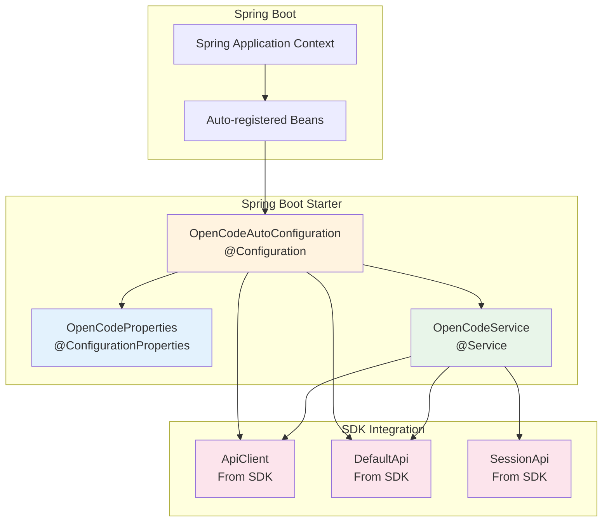

# OpenCode Spring Boot Starter

Spring Boot auto-configuration module for OpenCode SDK integration.

## Purpose

This module provides Spring Boot auto-configuration for the OpenCode SDK, allowing easy integration into Spring Boot applications with minimal configuration. It uses explicit getters/setters (no Lombok) to keep the dependency surface minimal.

## Architecture



## Key Classes

| Class | Package | Description |
|-------|---------|-------------|
| `OpenCodeAutoConfiguration` | `opencode.sdk.springboot.autoconfigure` | Configuration class creating SDK beans with `@ConditionalOnMissingBean` |
| `OpenCodeProperties` | `opencode.sdk.springboot.autoconfigure` | Configuration properties binding with `opencode.*` prefix |
| `OpenCodeService` | `opencode.sdk.springboot` | Spring-managed service wrapper exposing `DefaultApi` and `SessionApi` |

## Code Style Guidelines

### NO Lombok
This module does NOT use Lombok. All classes use explicit getters and setters to minimize the dependency surface.

```java
// CORRECT - Explicit getters/setters
@ConfigurationProperties(prefix = "opencode")
public class OpenCodeProperties {
    private String baseUrl = "http://localhost:4096";
    private String username;
    private String password;

    public String getBaseUrl() {
        return baseUrl;
    }

    public void setBaseUrl(String baseUrl) {
        this.baseUrl = baseUrl;
    }
    // ... remaining getters/setters
}
```

### Auto-Configuration Patterns

1. **Use @ConditionalOnMissingBean**
   ```java
   @Bean
   @ConditionalOnMissingBean
   public ApiClient apiClient(OpenCodeProperties properties) {
       ApiClient client = new ApiClient();
       client.updateBaseUri(properties.getBaseUrl());
       return client;
   }
   ```

2. **Enable Configuration Properties**
   ```java
   @Configuration
   @ConditionalOnClass(ApiClient.class)
   @EnableConfigurationProperties(OpenCodeProperties.class)
   public class OpenCodeAutoConfiguration {
       // ...
   }
   ```

3. **Constructor Injection** (explicit, no Lombok)
   ```java
   @Service
   public class OpenCodeService {
       private final DefaultApi defaultApi;
       private final ApiClient apiClient;

       public OpenCodeService(DefaultApi defaultApi, ApiClient apiClient) {
           this.defaultApi = defaultApi;
           this.apiClient = apiClient;
       }
   }
   ```

### Configuration Properties

Prefix all properties with `opencode.*`:

```yaml
opencode:
  base-url: http://localhost:4096
  username: opencode
  password: opencode123
```

### Package Structure
```
opencode.sdk.springboot/
├── OpenCodeService.java
└── autoconfigure/
    ├── OpenCodeAutoConfiguration.java
    └── OpenCodeProperties.java
```

## Dependencies

| Dependency | Scope | Purpose |
|------------|-------|---------|
| OpenCode SDK | compile | Core SDK library |
| Spring Boot Starter WebMvc | compile | Spring Boot web support (renamed from `spring-boot-starter-web` in Spring Boot 4.0) |
| Spring Boot Jackson 2 | compile | Jackson 2 compatibility module (Jackson 3 migration deferred) |
| Spring Boot Configuration Processor | provided | Configuration metadata |

## Auto-Configuration Registration

The starter registers auto-configuration via:
- File: `META-INF/spring/org.springframework.boot.autoconfigure.AutoConfiguration.imports`
- Content: `opencode.sdk.springboot.autoconfigure.OpenCodeAutoConfiguration`

## Build Commands

```bash
# Compile starter module
mvn clean compile

# Install to local repository
mvn clean install

# Skip tests
mvn clean install -DskipTests
```

## Configuration Metadata

The configuration processor generates metadata in:
- `target/classes/META-INF/spring-configuration-metadata.json`

This enables IDE auto-completion for `opencode.*` properties.

## Usage in Applications

### Maven Dependency

```xml
<dependency>
    <groupId>io.opencode</groupId>
    <artifactId>opencode-spring-boot-starter</artifactId>
    <version>${project.version}</version>
</dependency>
```

### application.properties Configuration

```properties
opencode.base-url=http://localhost:4096
opencode.username=${OPENCODE_USERNAME}
opencode.password=${OPENCODE_PASSWORD}
```

### Service Injection

```java
@Service
public class MyService {
    private final OpenCodeService openCodeService;

    public MyService(OpenCodeService openCodeService) {
        this.openCodeService = openCodeService;
    }

    public void doSomething() throws ApiException {
        GlobalHealth200Response health = openCodeService.getHealth();
        DefaultApi api = openCodeService.api();
        SessionApi sessionApi = openCodeService.sessionApi();
    }
}
```

## Testing

- Do NOT create tests until directly asked
- When testing auto-configuration, use `@TestConfiguration`
- Mock `ApiClient` or `DefaultApi` for unit tests
- Use `@SpringBootTest` for integration tests

## Spring Boot Best Practices

1. **Conditional Beans**: Use `@ConditionalOnMissingBean` to allow override
2. **Configuration Properties**: Use relaxed binding (kebab-case in YAML, camelCase in Java)
3. **Default Values**: Provide sensible defaults in `OpenCodeProperties`
4. **Validation**: Use JSR-303 annotations on properties when needed
5. **Documentation**: Keep property descriptions in configuration metadata

## Integration with SDK

The starter depends on the SDK module and:
1. Creates `ApiClient` bean with Basic Auth configuration from properties
2. Creates `DefaultApi` bean from `ApiClient`
3. Exposes `OpenCodeService` as a convenience wrapper providing access to both `DefaultApi` and `SessionApi`

## Version Compatibility

- Spring Boot: 4.0.x
- Java: 21+
- Aligns with SDK module version
- Uses `spring-boot-jackson2` compat module (Jackson 3 migration deferred)
- Jakarta EE 11 baseline (`jakarta.annotation-api` 3.0.0)
