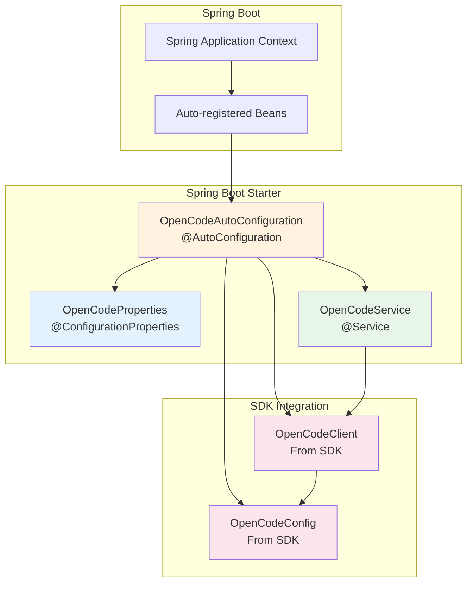

# OpenCode Spring Boot Starter

Spring Boot auto-configuration module for OpenCode SDK integration.

## Purpose

This module provides Spring Boot auto-configuration for the OpenCode SDK, allowing easy integration into Spring Boot applications with minimal configuration. It uses Lombok for boilerplate code reduction.

## Architecture



## Key Classes

| Class | Package | Description |
|-------|---------|-------------|
| `OpenCodeAutoConfiguration` | `opencode.sdk.springboot.autoconfigure` | Auto-configuration class creating SDK beans |
| `OpenCodeProperties` | `opencode.sdk.springboot.autoconfigure` | Configuration properties binding with `opencode.*` prefix |
| `OpenCodeService` | `opencode.sdk.springboot` | Spring-managed service wrapper for SDK client |

## Code Style Guidelines

### Lombok Usage
This module USES Lombok. Use annotations for boilerplate reduction:

```java
// CORRECT - Use Lombok
@Getter
@Setter
@ConfigurationProperties(prefix = "opencode")
public class OpenCodeProperties {
    private String baseUrl = "http://localhost:8080";
    private String apiKey;
    private int timeout = 30;
}

// Service with constructor injection
@Service
@RequiredArgsConstructor
public class OpenCodeService {
    private final OpenCodeClient openCodeClient;
}
```

### Auto-Configuration Patterns

1. **Use @ConditionalOnMissingBean**
   ```java
   @Bean
   @ConditionalOnMissingBean
   public OpenCodeClient openCodeClient(OpenCodeConfig config) {
       return new OpenCodeClient(config);
   }
   ```

2. **Enable Configuration Properties**
   ```java
   @AutoConfiguration
   @EnableConfigurationProperties(OpenCodeProperties.class)
   public class OpenCodeAutoConfiguration {
       // ...
   }
   ```

3. **Constructor Injection**
   ```java
   @AutoConfiguration
   @RequiredArgsConstructor
   public class OpenCodeAutoConfiguration {
       private final OpenCodeProperties properties;
   }
   ```

### Configuration Properties

Prefix all properties with `opencode.*`:

```yaml
opencode:
  base-url: http://localhost:4096
  api-key: your-api-key
  timeout: 30
```

### Package Structure
```
opencode.sdk.springboot/
├── OpenCodeService.java
└── autoconfigure/
    ├── OpenCodeAutoConfiguration.java
    └── OpenCodeProperties.java
```

## Dependencies

| Dependency | Version | Scope | Purpose |
|------------|---------|-------|---------|
| OpenCode SDK | ${project.version} | compile | Core SDK library |
| Spring Boot Starter Web | 3.5.12 | compile | Spring Boot web support |
| Spring Boot Configuration Processor | 3.5.12 | provided | Configuration metadata |
| Lombok | 1.18.36 | provided | Boilerplate reduction |

## Auto-Configuration Registration

The starter registers auto-configuration via:
- File: `META-INF/spring/org.springframework.boot.autoconfigure.AutoConfiguration.imports`
- Content: `opencode.sdk.springboot.autoconfigure.OpenCodeAutoConfiguration`

## Build Commands

```bash
# Compile starter module
mvn clean compile

# Install to local repository
mvn clean install

# Skip tests
mvn clean install -DskipTests
```

## Configuration Metadata

The configuration processor generates metadata in:
- `target/classes/META-INF/spring-configuration-metadata.json`

This enables IDE auto-completion for `opencode.*` properties.

## Usage in Applications

### Maven Dependency

```xml
<dependency>
    <groupId>io.opencode</groupId>
    <artifactId>opencode-spring-boot-starter</artifactId>
    <version>0.1.0-SNAPSHOT</version>
</dependency>
```

### application.yml Configuration

```yaml
opencode:
  base-url: http://localhost:4096
  api-key: ${OPENCODE_API_KEY}
  timeout: 30
```

### Service Injection

```java
@Service
@RequiredArgsConstructor
public class MyService {
    private final OpenCodeService openCodeService;
    
    public void doSomething() {
        ApiResponse response = openCodeService.getData("/v1/resources");
    }
}
```

## Testing

- Do NOT create tests until directly asked
- When testing auto-configuration, use `@TestConfiguration`
- Mock `OpenCodeClient` for unit tests
- Use `@SpringBootTest` for integration tests

## Spring Boot Best Practices

1. **Conditional Beans**: Use `@ConditionalOnMissingBean` to allow override
2. **Configuration Properties**: Use relaxed binding (kebab-case in YAML, camelCase in Java)
3. **Default Values**: Provide sensible defaults in `OpenCodeProperties`
4. **Validation**: Use JSR-303 annotations on properties when needed
5. **Documentation**: Keep property descriptions in configuration metadata

## Integration with SDK

The starter depends on the SDK module and:
1. Creates `OpenCodeConfig` bean from properties
2. Creates `OpenCodeClient` bean with configuration
3. Exposes `OpenCodeService` as a convenience wrapper

## Version Compatibility

- Spring Boot: 3.5.12+
- Java: 21+
- Aligns with SDK module version
