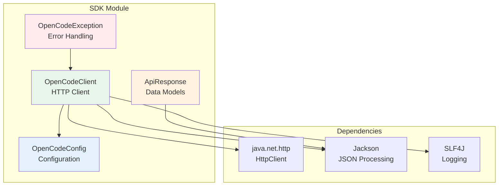

# OpenCode SDK Module

Core SDK library for OpenCode API client - plain Java library without Lombok for maximum compatibility.

## Purpose

This module provides the foundational HTTP client library for communicating with the OpenCode server API. It is designed as a plain Java library without Lombok to ensure compatibility with all Java projects, including those that don't use Lombok.

## Architecture



## Key Classes

| Class | Package | Description |
|-------|---------|-------------|
| `OpenCodeClient` | `opencode.sdk.client` | Main HTTP client for API communication |
| `OpenCodeConfig` | `opencode.sdk.config` | Configuration properties (baseUrl, apiKey, timeout) |
| `ApiResponse` | `opencode.sdk.model` | Standard API response wrapper |
| `OpenCodeException` | `opencode.sdk` | Base runtime exception for SDK errors |

## Code Style Guidelines

### NO Lombok
This module does NOT use Lombok. All classes must use explicit getters and setters:

```java
// CORRECT - Explicit getters/setters
public class OpenCodeConfig {
    private String baseUrl;
    
    public String getBaseUrl() {
        return baseUrl;
    }
    
    public void setBaseUrl(String baseUrl) {
        this.baseUrl = baseUrl;
    }
}

// INCORRECT - Do not use Lombok
@Getter @Setter
public class OpenCodeConfig {
    private String baseUrl;
}
```

### Class Organization
- Do NOT create inner classes
- Create separate classes in the same package instead
- Keep classes under 200 lines when possible
- One public class per file

### Package Structure
```
opencode.sdk/
├── OpenCodeException.java          # Base exception
├── client/
│   └── OpenCodeClient.java         # HTTP client
├── config/
│   └── OpenCodeConfig.java         # Configuration
└── model/
    └── ApiResponse.java            # Response model
```

### Error Handling
- Extend `OpenCodeException` for all SDK-specific exceptions
- Use checked exceptions only when caller can reasonably recover
- Use SLF4J for logging, never System.out

```java
// Correct error handling
try {
    // API call
} catch (IOException e) {
    logger.error("Failed to connect to OpenCode server: {}", e.getMessage());
    throw new OpenCodeException("Connection failed: " + e.getMessage());
}
```

## Dependencies

| Dependency | Version | Scope | Purpose |
|------------|---------|-------|---------|
| Jackson Databind | 2.18.2 | compile | JSON serialization/deserialization |
| SLF4J API | 2.0.16 | compile | Logging facade |
| JUnit Jupiter | 5.11.4 | test | Unit testing |
| AssertJ | 3.26.3 | test | Fluent assertions |

## Build Commands

```bash
# Compile SDK module
mvn clean compile

# Run tests
mvn test

# Install to local repository
mvn clean install

# Skip tests during install
mvn clean install -DskipTests
```

## HTTP Implementation Guidelines

When implementing HTTP methods in `OpenCodeClient`:

1. **Use Java 11+ HttpClient**
   ```java
   private final HttpClient httpClient = HttpClient.newHttpClient();
   ```

2. **Support Async Operations**
   - Provide both synchronous and asynchronous methods
   - Use `CompletableFuture` for async operations

3. **Handle Authentication**
   - Read API key from `OpenCodeConfig`
   - Add Authorization header to all requests

4. **JSON Processing**
   - Use Jackson `ObjectMapper` for JSON parsing
   - Create specific model classes for each API endpoint

5. **Timeout Configuration**
   - Respect timeout settings from `OpenCodeConfig`
   - Default timeout: 30 seconds

## Testing

- Do NOT create tests until directly asked
- When testing, use JUnit 5 and AssertJ
- Mock external HTTP calls
- Test configuration validation

## API Reference

Reference the OpenAPI specification at `../docker/opencode/openapi.json` for:
- Available endpoints
- Request/response schemas
- Authentication requirements
- Error codes

## Version Compatibility

This SDK module maintains backward compatibility:
- Public APIs should not change in patch releases
- Deprecated methods should be marked with `@Deprecated`
- Follow semantic versioning for breaking changes
