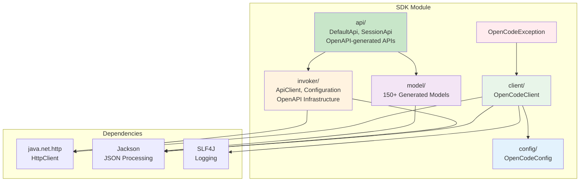

# OpenCode SDK Module

Core SDK library for OpenCode API client - plain Java library without Lombok for maximum compatibility.

## Purpose

This module provides the foundational HTTP client library for communicating with the OpenCode server API. It is designed as a plain Java library without Lombok to ensure compatibility with all Java projects, including those that don't use Lombok.

## Architecture



## Key Classes

| Class | Package | Description |
|-------|---------|-------------|
| [`DefaultApi`](api/DefaultApi.java) | `opencode.sdk.api` | Auto-generated API class - main entry point for all API calls |
| [`SessionApi`](api/SessionApi.java) | `opencode.sdk.api` | Auto-generated session-specific API methods |
| [`OpenCodeClient`](client/OpenCodeClient.java) | `opencode.sdk.client` | Custom HTTP client wrapper |
| [`OpenCodeConfig`](config/OpenCodeConfig.java) | `opencode.sdk.config` | Configuration properties |
| [`ApiClient`](invoker/ApiClient.java) | `opencode.sdk.invoker` | OpenAPI-generated base HTTP client |
| [`Configuration`](invoker/Configuration.java) | `opencode.sdk.invoker` | Global SDK configuration |
| [`ApiResponse`](model/ApiResponse.java) | `opencode.sdk.model` | Standard API response wrapper |
| [`OpenCodeException`](OpenCodeException.java) | `opencode.sdk` | Base runtime exception for SDK errors |

## Code Style Guidelines

### NO Lombok
This module does NOT use Lombok. All classes must use explicit getters and setters:

```java
// CORRECT - Explicit getters/setters
public class OpenCodeConfig {
    private String baseUrl;
    
    public String getBaseUrl() {
        return baseUrl;
    }
    
    public void setBaseUrl(String baseUrl) {
        this.baseUrl = baseUrl;
    }
}

// INCORRECT - Do not use Lombok
@Getter @Setter
public class OpenCodeConfig {
    private String baseUrl;
}
```

### Class Organization
- Do NOT create inner classes
- Create separate classes in the same package instead
- Keep classes under 200 lines when possible
- One public class per file

## Package Structure

```
opencode.sdk/
├── OpenCodeException.java           # Base exception
├── api/                             # OpenAPI-generated API classes
│   ├── DefaultApi.java              # Main API methods
│   └── SessionApi.java              # Session-specific methods
├── client/
│   └── OpenCodeClient.java          # HTTP client
├── config/
│   └── OpenCodeConfig.java          # Configuration
├── invoker/                         # OpenAPI infrastructure
│   ├── ApiClient.java               # Base HTTP client
│   ├── ApiException.java            # API exception
│   ├── ApiResponse.java             # Response wrapper
│   ├── Configuration.java           # SDK configuration
│   ├── Pair.java                    # Key-value utility
│   ├── ServerConfiguration.java     # Server config
│   └── ServerVariable.java          # Server variable
└── model/                           # 150+ generated models
    ├── ApiResponse.java             # Response model
    ├── Config.java                  # Configuration model
    ├── Session.java                 # Session model
    └── ... (150+ additional models)
```

## OpenAPI Code Generation

### Generated Packages
The following packages contain **auto-generated code** from the OpenAPI specification and **should not be manually edited**:

- **`opencode.sdk.api/`** - API endpoint classes ([`DefaultApi`](api/DefaultApi.java), [`SessionApi`](api/SessionApi.java))
- **`opencode.sdk.invoker/`** - OpenAPI infrastructure classes ([`ApiClient`](invoker/ApiClient.java), [`Configuration`](invoker/Configuration.java), [`ApiException`](invoker/ApiException.java), [`Pair`](invoker/Pair.java), [`ServerConfiguration`](invoker/ServerConfiguration.java), [`ServerVariable`](invoker/ServerVariable.java))
- **`opencode.sdk.model/`** - 150+ data model classes representing API request/response schemas

### Regenerating Code
To regenerate the OpenAPI code:

```bash
cd sdk
mvn clean generate-sources
```

The OpenAPI specification is located at `sdk/src/main/resources/openapi.json`.

### Custom Development
Only modify code in these packages:
- **`opencode.sdk.client/`** - Custom wrapper classes
- **`opencode.sdk.config/`** - Custom configuration classes
- **Root package** - Custom exception classes

## API Packages

### opencode.sdk.api

Contains OpenAPI-generated API classes with 50+ endpoint methods:

#### DefaultApi
Main API class with comprehensive endpoint coverage:

**Application Endpoints:**
- `appAgents()` - Get configured agents
- `appLog()` - Retrieve application logs
- `appSkills()` - List available skills

**Authentication:**
- `authRemove()` - Remove authentication
- `authSet()` - Set authentication credentials

**Commands:**
- `commandList()` - List available commands

**Configuration:**
- `configGet()` - Get current configuration
- `configProviders()` - List configuration providers
- `configUpdate()` - Update configuration

**Events:**
- `eventSubscribe()` - Subscribe to server events

**File Operations:**
- `fileList()` - List files in workspace
- `fileRead()` - Read file content
- `fileStatus()` - Get file status

**Search:**
- `findFiles()` - Search for files
- `findSymbols()` - Search for code symbols
- `findText()` - Search for text in files

**Formatter:**
- `formatterStatus()` - Get formatter status

**Global Operations:**
- `globalConfigGet()` - Get global configuration
- `globalConfigUpdate()` - Update global configuration
- `globalDispose()` - Dispose global resources
- `globalEvent()` - Handle global events
- `globalHealth()` - Health check endpoint

**Instance Management:**
- `instanceDispose()` - Dispose instance resources

**LSP:**
- `lspStatus()` - Get Language Server Protocol status

**MCP (Model Context Protocol):**
- `mcpAdd()` - Add MCP server
- `mcpAuthCallback()` - Handle MCP authentication callback
- `mcpAuthRemove()` - Remove MCP authentication
- `mcpAuthStart()` - Start MCP authentication
- `mcpBrowse()` - Browse MCP resources
- `mcpList()` - List MCP servers
- `mcpPrompt()` - Send prompt to MCP
- `mcpRemove()` - Remove MCP server
- `mcpResourcesList()` - List MCP resources
- `mcpToolsCall()` - Call MCP tool
- `mcpToolsList()` - List MCP tools

**Provider Operations:**
- `providerList()` - List available providers
- `providerOauthAuthorize()` - Authorize OAuth provider
- `providerOauthCallback()` - Handle OAuth callback

**PTY (Pseudo-terminal):**
- `ptyCreate()` - Create pseudo-terminal
- `ptyDelete()` - Delete pseudo-terminal
- `ptyUpdate()` - Update pseudo-terminal

**Questions:**
- `questionReply()` - Reply to questions

**Sessions:**
- `sessionChildren()` - Get session children
- `sessionCompact()` - Compact session
- `sessionCreate()` - Create new session
- `sessionDelete()` - Delete session
- `sessionDiff()` - Get session diff
- `sessionFork()` - Fork session
- `sessionGet()` - Get session details
- `sessionInit()` - Initialize session
- `sessionMessages()` - Get session messages
- `sessionPrompt()` - Send prompt to session
- `sessionRevert()` - Revert session
- `sessionShell()` - Execute shell in session
- `sessionStatus()` - Get session status
- `sessionSummarize()` - Summarize session
- `sessionUpdate()` - Update session

**TUI (Terminal UI):**
- `tuiControlNext()` - Control TUI navigation
- `tuiExecuteCommand()` - Execute TUI command
- `tuiPublish()` - Publish to TUI
- `tuiSelectSession()` - Select session in TUI
- `tuiShowToast()` - Show toast notification

#### SessionApi
Session-specific API operations:

- `sessionChildren()` - Get session children
- `sessionGet()` - Get session details

## Invoker Package

Contains OpenAPI infrastructure classes:

### ApiClient
Base HTTP client for API communication. Handles:
- HTTP connection management
- Request/response serialization
- Authentication
- Retry logic

### Configuration
Global SDK configuration class:
- Base URL and server configuration
- Default headers
- Timeout settings
- Authentication credentials

### ApiException
Exception thrown for API errors:
- HTTP error status codes
- Error response deserialization
- Detailed error messages

### ApiResponse<T>
Generic wrapper for API responses:
- HTTP status code
- Response headers
- Deserialized response body

### Pair
Key-value utility class for query parameters and headers.

### ServerConfiguration
Server configuration with:
- URL template
- Variables for server configuration
- Multiple server support

### ServerVariable
Server variable definition for configuration templates.

## Model Package

Contains 150+ generated model classes representing:
- API requests (e.g., [`SessionPromptRequest`](model/SessionPromptRequest.java), [`SessionCreateRequest`](model/SessionCreateRequest.java))
- API responses (e.g., [`Session`](model/Session.java), [`Config`](model/Config.java), [`GlobalHealth200Response`](model/GlobalHealth200Response.java))
- Data structures (e.g., [`Message`](model/Message.java), [`Part`](model/Part.java), [`FilePart`](model/FilePart.java))
- Configuration models (e.g., [`ProviderConfig`](model/ProviderConfig.java), [`Model`](model/Model.java))
- Event models (e.g., [`Event`](model/Event.java), [`EventSessionCreated`](model/EventSessionCreatedProperties.java))
- Error models (e.g., [`APIError`](model/APIError.java), [`BadRequestError`](model/BadRequestError.java))

### Error Handling
- Extend `OpenCodeException` for all SDK-specific exceptions
- Use checked exceptions only when caller can reasonably recover
- Use SLF4J for logging, never System.out

```java
// Correct error handling
try {
    // API call
} catch (IOException e) {
    logger.error("Failed to connect to OpenCode server: {}", e.getMessage());
    throw new OpenCodeException("Connection failed: " + e.getMessage());
}
```

## Dependencies

| Dependency | Version | Scope | Purpose |
|------------|---------|-------|---------|
| Jackson Databind | 2.18.2 | compile | JSON serialization/deserialization |
| Jackson Annotations | 2.18.2 | compile | Jackson annotations |
| Jackson Core | 2.18.2 | compile | Jackson core functionality |
| SLF4J API | 2.0.16 | compile | Logging facade |
| JUnit Jupiter | 5.11.4 | test | Unit testing |
| AssertJ | 3.26.3 | test | Fluent assertions |
| OpenAPI Generator | 7.10.0 | provided | Code generation |

## Build Commands

```bash
# Compile SDK module
mvn clean compile

# Generate OpenAPI code
mvn clean generate-sources

# Run tests
mvn test

# Install to local repository
mvn clean install

# Skip tests during install
mvn clean install -DskipTests
```

## HTTP Implementation Guidelines

When implementing HTTP methods in `OpenCodeClient`:

1. **Use Java 11+ HttpClient**
   ```java
   private final HttpClient httpClient = HttpClient.newHttpClient();
   ```

2. **Support Async Operations**
   - Provide both synchronous and asynchronous methods
   - Use `CompletableFuture` for async operations

3. **Handle Authentication**
   - Read API key from `OpenCodeConfig`
   - Add Authorization header to all requests

4. **JSON Processing**
   - Use Jackson `ObjectMapper` for JSON parsing
   - Create specific model classes for each API endpoint

5. **Timeout Configuration**
   - Respect timeout settings from `OpenCodeConfig`
   - Default timeout: 30 seconds

## Testing

- Do NOT create tests until directly asked
- When testing, use JUnit 5 and AssertJ
- Mock external HTTP calls
- Test configuration validation

## API Reference

Reference the OpenAPI specification at `src/main/resources/openapi.json` for:
- Available endpoints
- Request/response schemas
- Authentication requirements
- Error codes

## Version Compatibility

This SDK module maintains backward compatibility:
- Public APIs should not change in patch releases
- Deprecated methods should be marked with `@Deprecated`
- Follow semantic versioning for breaking changes
