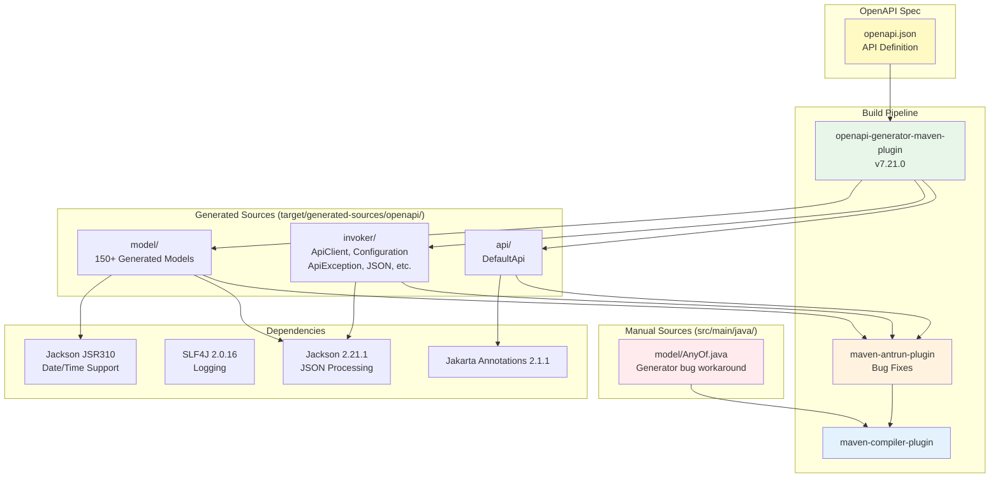

# OpenCode SDK Module

Core SDK library for OpenCode API client — fully auto-generated from OpenAPI specification.

## Purpose

This module provides the foundational HTTP client library for communicating with the OpenCode server API. The entire SDK (API classes, models, and infrastructure) is **auto-generated** from the OpenAPI specification using OpenAPI Generator. Only a single manual workaround file (`AnyOf.java`) is maintained in `src/main/java`.

## Architecture



## Key Classes

All classes below are **auto-generated** from `openapi.json` unless marked as manual.

| Class | Package | Source | Description |
|-------|---------|--------|-------------|
| `DefaultApi` | `opencode.sdk.api` | Generated | Main API class — entry point for all API calls |
| `ApiClient` | `opencode.sdk.invoker` | Generated | Base HTTP client for all API calls |
| `Configuration` | `opencode.sdk.invoker` | Generated | Global SDK configuration |
| `ApiException` | `opencode.sdk.invoker` | Generated | API exception handling |
| `ApiResponse<T>` | `opencode.sdk.invoker` | Generated | Generic response wrapper (invoker) |
| `JSON` | `opencode.sdk.invoker` | Generated | JSON serialization/deserialization |
| `Pair` | `opencode.sdk.invoker` | Generated | Key-value utility |
| `ServerConfiguration` | `opencode.sdk.invoker` | Generated | Server configuration |
| `ServerVariable` | `opencode.sdk.invoker` | Generated | Server variable definition |
| `AnyOf` | `opencode.sdk.model` | **Manual** | Workaround for generator bug with `anyOf: [{}, {"type": "null"}]` schemas |
| 150+ models | `opencode.sdk.model` | Generated | Data models for requests, responses, and data structures |

## Code Style Guidelines

### NO Lombok
This module does NOT use Lombok. All generated classes use explicit getters and setters.

### Class Organization
- Do NOT create inner classes
- Create separate classes in the same package instead
- Keep classes under 200 lines when possible (does not apply to generated code)
- One public class per file

## Package Structure

```
sdk/
├── openapi.json                                    # OpenAPI specification (source of truth)
├── pom.xml                                         # Build configuration with openapi-generator
├── src/
│   ├── main/
│   │   ├── java/opencode/sdk/
│   │   │   └── model/
│   │   │       └── AnyOf.java                      # Manual workaround (ONLY manual file)
│   │   └── resources/
│   │       └── .openapi-generator-ignore            # Excludes docs/ from generation
│   └── test/                                       # Tests (if any)
└── target/
    └── generated-sources/openapi/src/main/java/opencode/sdk/
        ├── api/
        │   └── DefaultApi.java                     # Generated API class
        ├── invoker/                                # Generated infrastructure
        │   ├── ApiClient.java
        │   ├── ApiException.java
        │   ├── ApiResponse.java
        │   ├── Configuration.java
        │   ├── JSON.java
        │   ├── Pair.java
        │   ├── RFC3339DateFormat.java
        │   ├── RFC3339InstantDeserializer.java
        │   ├── RFC3339JavaTimeModule.java
        │   ├── ServerConfiguration.java
        │   └── ServerVariable.java
        └── model/                                  # 150+ generated model classes
            ├── AbstractOpenApiSchema.java
            ├── Agent.java
            ├── Config.java
            ├── Event.java
            ├── Session.java
            └── ... (150+ additional models)
```

## OpenAPI Code Generation

### Build Pipeline

The SDK build (`mvn compile -pl sdk` or `mvn compile` from `sdk/`) runs three phases automatically:

1. **`openapi-generator-maven-plugin` (v7.21.0)** — generates Java sources from `sdk/openapi.json` into `target/generated-sources/openapi/`
   - Generator: `java` with `library: native`
   - API package: `opencode.sdk.api`
   - Model package: `opencode.sdk.model`
   - Invoker package: `opencode.sdk.invoker`
   - Uses Jakarta EE annotations, Java 8 date library
   - Skips generation of tests and documentation

2. **`maven-antrun-plugin` (v3.1.0)** — post-processes generated sources to fix known generator bugs:
   - Replaces `Map<K,V>.class` → `Map.class` (parameterized type literals are invalid Java)
   - Replaces `List<Object>.class` → `List.class`
   - Replaces `getMap<K,V>()` → `getMap()` (generics in method identifiers are invalid Java)
   - Replaces `getList<Object>()` → `getList()`

3. **`maven-compiler-plugin`** — compiles generated sources + `src/main/java/` together

### Known Generator Bugs Requiring Manual Workarounds

| Bug | Description | Fix |
|-----|-------------|-----|
| **Map<K,V>.class syntax** | Generator outputs `Map<String, FooValue>.class` in `anyOf` schemas containing map types | Fixed automatically by antrun plugin |
| **Missing `AnyOf` class** | Generator references `AnyOf` for schemas like `anyOf: [{}, {"type": "null"}]` but never generates the class | Manual `AnyOf.java` maintained in `src/main/java/opencode/sdk/model/` |

### Generated vs Manual Code

| Type | Location | Editable |
|------|----------|----------|
| API classes (`api/`) | `target/generated-sources/openapi/` | No — regenerated on build |
| Invoker classes (`invoker/`) | `target/generated-sources/openapi/` | No — regenerated on build |
| Model classes (`model/`) | `target/generated-sources/openapi/` | No — regenerated on build |
| `AnyOf.java` (`model/`) | `src/main/java/` | Yes — manual workaround |
| `.openapi-generator-ignore` | `src/main/resources/` | Yes — controls what gets generated |

### Regenerating Code

```bash
# Regenerate from sdk directory
cd sdk
mvn clean generate-sources

# Or from project root
mvn generate-sources -pl sdk -am

# Full rebuild (regenerate + compile)
cd sdk
mvn clean compile
```

The OpenAPI specification is located at `sdk/openapi.json`.

## API Package (opencode.sdk.api)

### DefaultApi

Main API class with comprehensive endpoint coverage:

**Application Endpoints:**
- `appAgents()` - Get configured agents
- `appLog()` - Retrieve application logs
- `appSkills()` - List available skills

**Authentication:**
- `authRemove()` - Remove authentication
- `authSet()` - Set authentication credentials

**Commands:**
- `commandList()` - List available commands

**Configuration:**
- `configGet()` - Get current configuration
- `configProviders()` - List configuration providers
- `configUpdate()` - Update configuration

**Events:**
- `eventSubscribe()` - Subscribe to server events

**File Operations:**
- `fileList()` - List files in workspace
- `fileRead()` - Read file content
- `fileStatus()` - Get file status

**Search:**
- `findFiles()` - Search for files
- `findSymbols()` - Search for code symbols
- `findText()` - Search for text in files

**Formatter:**
- `formatterStatus()` - Get formatter status

**Global Operations:**
- `globalConfigGet()` - Get global configuration
- `globalConfigUpdate()` - Update global configuration
- `globalDispose()` - Dispose global resources
- `globalEvent()` - Handle global events
- `globalHealth()` - Health check endpoint

**Instance Management:**
- `instanceDispose()` - Dispose instance resources

**LSP:**
- `lspStatus()` - Get Language Server Protocol status

**MCP (Model Context Protocol):**
- `mcpAdd()` - Add MCP server
- `mcpAuthCallback()` - Handle MCP authentication callback
- `mcpAuthRemove()` - Remove MCP authentication
- `mcpAuthStart()` - Start MCP authentication
- `mcpBrowse()` - Browse MCP resources
- `mcpList()` - List MCP servers
- `mcpPrompt()` - Send prompt to MCP
- `mcpRemove()` - Remove MCP server
- `mcpResourcesList()` - List MCP resources
- `mcpToolsCall()` - Call MCP tool
- `mcpToolsList()` - List MCP tools

**Provider Operations:**
- `providerList()` - List available providers
- `providerOauthAuthorize()` - Authorize OAuth provider
- `providerOauthCallback()` - Handle OAuth callback

**PTY (Pseudo-terminal):**
- `ptyCreate()` - Create pseudo-terminal
- `ptyDelete()` - Delete pseudo-terminal
- `ptyUpdate()` - Update pseudo-terminal

**Questions:**
- `questionReply()` - Reply to questions

**Sessions:**
- `sessionChildren()` - Get session children
- `sessionCompact()` - Compact session
- `sessionCreate()` - Create new session
- `sessionDelete()` - Delete session
- `sessionDiff()` - Get session diff
- `sessionFork()` - Fork session
- `sessionGet()` - Get session details
- `sessionInit()` - Initialize session
- `sessionMessages()` - Get session messages
- `sessionPrompt()` - Send prompt to session
- `sessionRevert()` - Revert session
- `sessionShell()` - Execute shell in session
- `sessionStatus()` - Get session status
- `sessionSummarize()` - Summarize session
- `sessionUpdate()` - Update session

**TUI (Terminal UI):**
- `tuiControlNext()` - Control TUI navigation
- `tuiExecuteCommand()` - Execute TUI command
- `tuiPublish()` - Publish to TUI
- `tuiSelectSession()` - Select session in TUI
- `tuiShowToast()` - Show toast notification

## Invoker Package (opencode.sdk.invoker)

Contains OpenAPI infrastructure classes (all auto-generated):

### ApiClient
Base HTTP client for API communication. Handles:
- HTTP connection management
- Request/response serialization
- Authentication (including Basic Auth via `setRequestInterceptor`)
- Server configuration

### Configuration
Global SDK configuration class:
- Base URL and server configuration
- Default headers
- Timeout settings
- Authentication credentials

### ApiException
Exception thrown for API errors:
- HTTP error status codes
- Error response deserialization
- Detailed error messages

### ApiResponse<T>
Generic wrapper for API responses:
- HTTP status code
- Response headers
- Deserialized response body

### JSON
Jackson-based JSON serialization/deserialization for API requests and responses.

### Pair
Key-value utility class for query parameters and headers.

### ServerConfiguration / ServerVariable
Server configuration with URL templates and variables for multi-server support.

## Model Package (opencode.sdk.model)

Contains 150+ generated model classes representing:
- API requests (e.g., `SessionPromptRequest`, `SessionCreateRequest`)
- API responses (e.g., `Session`, `Config`, `GlobalHealth200Response`)
- Data structures (e.g., `Message`, `Part`, `FilePart`)
- Configuration models (e.g., `ProviderConfig`, `Model`)
- Event models (e.g., `Event`, `EventSessionCreated`)
- Error models (e.g., `APIError`, `BadRequestError`)

### Error Handling
- Use `ApiException` from the invoker package for API-level errors
- Use SLF4J for logging, never System.out

```java
// Correct error handling
try {
    GlobalHealth200Response health = api.globalHealth();
} catch (ApiException e) {
    logger.error("API call failed: {} (status {})", e.getMessage(), e.getCode());
}
```

## Dependencies

| Dependency | Version | Scope | Purpose |
|------------|---------|-------|---------|
| Jackson Databind | 2.21.1 | compile | JSON serialization/deserialization |
| Jackson Annotations | 2.21 | compile | Jackson annotations for generated code |
| Jackson Core | 2.21.1 | compile | Jackson core functionality |
| Jackson Datatype JSR310 | 2.21.1 | compile | Java 8 date/time support for generated code |
| Jakarta Annotation API | 2.1.1 | compile | Jakarta annotations for generated code |
| SLF4J API | 2.0.16 | compile | Logging facade |
| JUnit Jupiter | 5.11.4 | test | Unit testing |
| AssertJ | 3.26.3 | test | Fluent assertions |
| OpenAPI Generator | 7.21.0 | plugin | Code generation |
| Maven AntRun Plugin | 3.1.0 | plugin | Post-processing generated sources |

## Build Commands

```bash
# Compile SDK module (generates + compiles)
cd sdk && mvn clean compile

# Compile from project root
mvn compile -pl sdk -am

# Generate sources only (no compile)
cd sdk && mvn generate-sources

# Run tests
cd sdk && mvn test

# Install to local repository
cd sdk && mvn clean install

# Skip tests during install
cd sdk && mvn clean install -DskipTests
```

## Usage Example

```java
import opencode.sdk.api.DefaultApi;
import opencode.sdk.invoker.ApiClient;
import opencode.sdk.invoker.ApiException;
import opencode.sdk.model.GlobalHealth200Response;

// Create client with Basic Auth
ApiClient apiClient = new ApiClient();
apiClient.updateBaseUri("http://localhost:4096");
String auth = Base64.getEncoder().encodeToString("opencode:opencode123".getBytes());
apiClient.setRequestInterceptor(builder -> builder.header("Authorization", "Basic " + auth));

// Create API instance
DefaultApi api = new DefaultApi(apiClient);

// Call API
GlobalHealth200Response health = api.globalHealth();
```

## Testing

- Do NOT create tests until directly asked
- When testing, use JUnit 5 and AssertJ
- Mock `ApiClient` or use integration tests against a running server
- Test configuration validation

## API Reference

Reference the OpenAPI specification at `sdk/openapi.json` for:
- Available endpoints
- Request/response schemas
- Authentication requirements
- Error codes

## Version Compatibility

- Java 21+
- No Lombok dependency
- Compatible with any Java project (no framework dependencies beyond Jackson and SLF4J)
